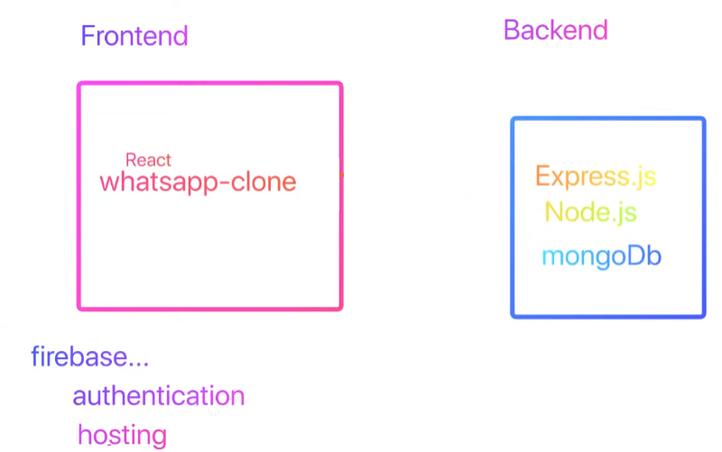
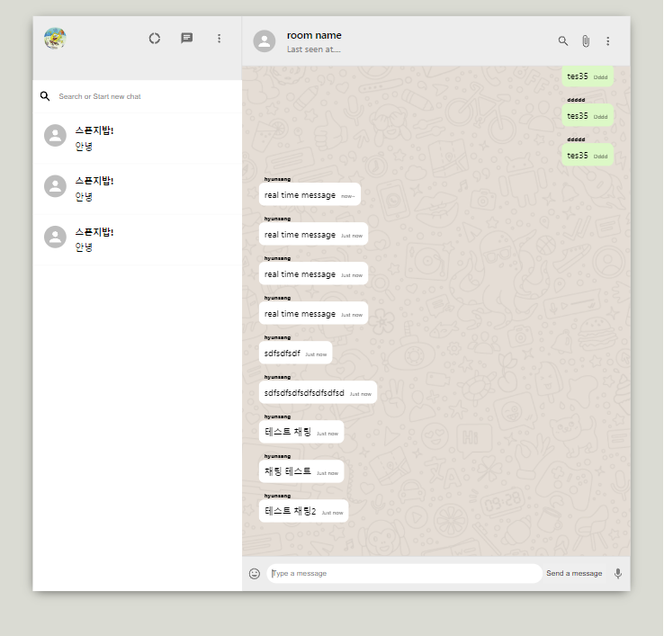

#whats app clone하기 (MERN)


#### MERN 이란?
###### MongoDB
###### Express
###### React
###### Node.js
-------------

#### 구조 설명
  


-------------

#### 폴더 구조
###### whatsapp-mern
###### ㄴ whatsapp-frontend
###### ㄴ whatsapp-backend
-------------


#### whatsapp-frontend

```
//추가 lib 설치 내역
npm i axios pusher-js
```

##### 역할

mongo db에서 획득한 데이터를 바탕으로 화면에 채팅 내역을 보여줌


#### whatsapp-backend

```
//추가 lib 설치 내역
npm i express cors mongoose pusher
```

##### 역할

채팅 내역 db 저장
app.post('/message/new')

db에서 채팅 목록 획득
app.get('/message/sync')


채팅이 일어날 경우 pusher trigger 발생 등


#### 결과
  